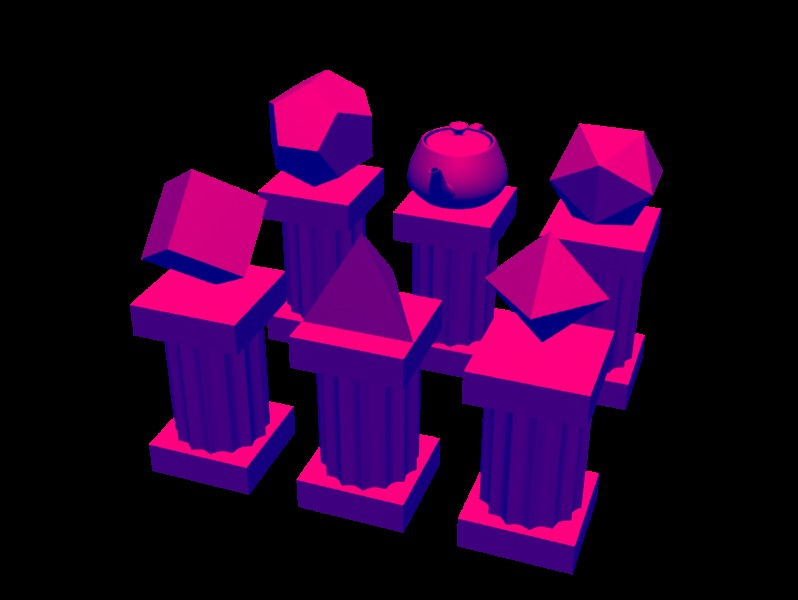

# Cosmic Geometry
Platonic solids and a teapot rendered using Renderman shaders as an exercise at [MFF CUNI](https://www.mff.cuni.cz).

## Installation
To use the makefile, you'll need [3Delight](http://www.3delight.com/en/). If you're not on Windows, remove the *.exe* suffixes from the commands. You do not need ImageMagick, the target *convert* is mostly there for the use of this repsitory.

During the rendering the error `'voronoi.tdl' not found` is thrown twice because the texture is only ready (and actually used) in the third pass of the render. So just ignore it.

